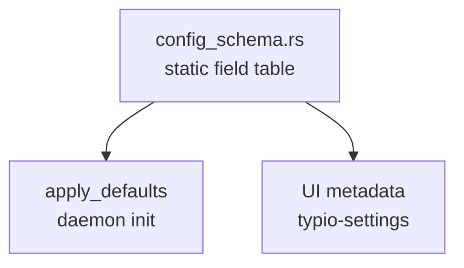

# Configuration System

## Design Goal

All configuration fields, their types, defaults, and UI metadata are defined once in a static schema table (`config_schema.rs`). Every other component — the daemon, control surfaces, user documentation — derives its behaviour from that table rather than maintaining parallel field lists.

## Single Source Of Truth



The schema table is the only place where a new configuration field needs to be declared. Adding a field means adding one `TypioConfigField` entry; no other source file needs a parallel definition.

## Configuration Lifecycle

### 1. Load

`typio_instance_init` reads `typio.toml` from the config directory:

```text
load_file(path)  ->  TypioConfig (flat key-value store)
```

The parser handles a TOML-compatible subset: top-level keys, `[section]` headers, and `key = value` pairs. Dotted keys are built by joining `section.key`.

**Known parser limitations:**

- No nested tables (`[a.b.c]` works; inline `{...}` does not)
- No array-of-tables (`[[array]]`)
- No multiline strings
- No inline arrays (TOML `[1, 2, 3]`)

These are sufficient for Typio's flat configuration model.

### 2. Apply Defaults

`typio_config_apply_defaults` iterates the schema table and sets any missing key to the field's default value. Existing user values are never overwritten.

Defaults are applied after initial load, after `ReloadConfig()`, and after a valid `SetConfigText(s)` replacement has been parsed. Empty `SetConfigText` content is rejected before defaults are applied so an accidental blank write cannot silently become a full default config.

After this step the daemon holds a complete config with no missing defaults.

### 3. Hold

`TypioInstance` owns the live `TypioConfig *`. All daemon subsystems read from it. Engine-specific sections are extracted via `typio_instance_get_engine_config(instance, "rime")`, which returns a copied sub-config.

### 4. Expose Over D-Bus

The D-Bus service, path, and interface constants are defined in `typio/dbus_protocol.h` (part of the public library) so that both the server and control surfaces use the same values without cross-layer include dependencies.

The status bus exposes two config-related properties:

- **`ConfigText`** — the full config serialised to text (`typio_instance_get_config_text`)
- **`ActiveEngineState`** — includes engine-specific config entries prefixed with `config.*`

And two config-mutating methods:

- **`SetConfigText(s)`** — parse -> defaults -> save -> reload
- **`ReloadConfig()`** — re-read file from disk -> defaults -> switch engine if needed -> notify callback

Both emit `PropertiesChanged` after completing.

### 5. Edit From Control Surfaces

Control surfaces follow the instant-apply model documented in [Control Surfaces](control-surfaces.md):

1. Read `ConfigText` from the daemon
2. Seed a local stage
3. Let the user edit
4. Submit the full staged config via `SetConfigText`

Control surfaces never write `typio.toml` directly.

### 6. Reload

`typio_instance_reload_config` (called by `SetConfigText`, `ReloadConfig`, or the debounced config-watch timer) replaces the in-memory config, re-runs defaults, switches the active engine if `default_engine` changed, tells the active engine to `reload_config`, and fires the `config_reloaded_callback`. The Wayland frontend registers this callback to refresh shortcuts, voice, and the status bus.

Inotify events do not reload config directly. `wl_runtime_config.c` schedules a short debounce timer so common editor save patterns (`write`, `rename`, `chmod`, multiple close events) collapse into one reload. If the watched file is deleted, moved, or atomically replaced, the watcher is rearmed before the reload is scheduled.

The callback boundary means Typio accepted the new config and refreshed the runtime pipeline. It does not require every optional subsystem to finish heavy work synchronously. In particular, voice backends may continue loading a replacement model on a background thread after `reload_config` returns.

### 7. Explicit Rime Deploy

`typio_instance_deploy_rime_config` is the manual rebuild path for out-of-band Rime edits under `user_data_dir`, such as `default.custom.yaml`. Unlike normal config reload, this path forces librime maintenance and invalidates generated `build/*.yaml` artifacts first so rapid successive edits still rebuild even if filesystem timestamps land in the same second.

After deployment completes, the engine increments an internal `deploy_id`. All existing Rime sessions track the `deploy_id` at the time of their creation. On the next interaction, the engine detects the mismatch, transparently destroys the stale librime session, and recreates it using the newly compiled Rime data. This ensures that changes take effect immediately in all open applications without requiring a Typio restart.

## Schema Table Structure

Each `TypioConfigField` entry contains:

| Field | Purpose |
|-------|---------|
| `key` | Canonical dotted key, e.g. `display.font_size` |
| `type` | `STRING`, `INT`, `BOOL`, or `FLOAT` |
| `def` | Default value (typed union) |
| `ui_label` | Display label for control surfaces |
| `ui_section` | Logical grouping (`display`, `rime`, `shortcuts`...) |
| `ui_min/max/step` | Range constraints for numeric fields |
| `ui_options` | `NULL`-terminated string array for dropdowns |
| `runtime_property` | Matching D-Bus runtime property, or `NULL` |

Fields without `ui_label` are internal (no UI representation).

Fields with `runtime_property` are still persisted config keys. The extra metadata means the key has a direct daemon runtime mirror and control surfaces should prefer that runtime property for display state when appropriate. See [Config & Runtime Ownership](config-runtime-ownership.md).

## How To Add A New Configuration Field

1. Add one `TypioConfigField` entry to `schema_fields[]` in `config_schema.rs`.
2. If it should appear in `typio-settings`, set the `ui_*` fields.
3. Update [Configuration Reference](../reference/configuration.md) with the user-facing description.
4. No other code changes are needed for the field to be parsed, defaulted, serialised, and exposed over D-Bus.

## Invariants

- The daemon is the only writer of `typio.toml`.
- `ConfigText` round-trips: `load_string(to_string(config))` produces an equivalent config.
- `apply_defaults` never overwrites a user-set value.
- All daemon-owned config entry points apply schema defaults before publishing the config to runtime subsystems.
- Config watch reloads are debounced and must be safe across atomic file replacement.
- Control surfaces must not write config state before receiving the first `ConfigText` from the daemon (see the known failure pattern in [Control Surfaces](control-surfaces.md)).
